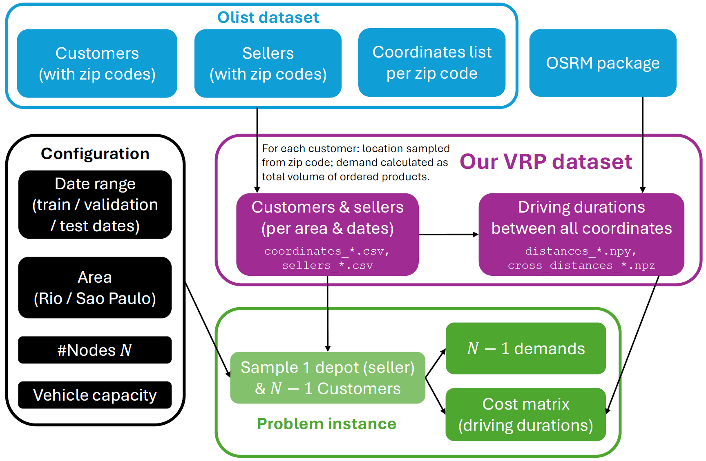
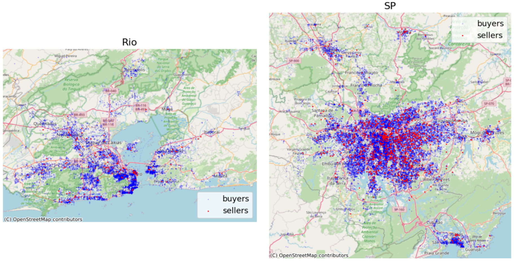

# VRP Benchmark Based on Real-world Online-shopping Data

This repo introduces a benchmark for Vehicle Routing Problems (VRP), based on real-world e-commerce data by Olist.
The repo includes both an on-the-fly problem-generator, and a constant test-set of problems for reference.

- [How to use](#how-to-use)
  - [Generate new problems](#generate-new-random-problem-instances)
  - [Load our test problems](#load-our-test-and-validation-problems)
- [Background: VRP](#background-vrp)
- [Why a new benchmark?](#why-a-new-benchmark)
- [How we created the benchmark](#how-we-created-the-benchmark-from-real-data)
  - [Locations](#locations-orders-and-depots)
  - [Driving times](#costs-driving-times)
- [How problem instances are generated](#how-to-generate-random-problem-instances)
- [Data directory tree](#data-directory-tree)
- [Cite us](#cite-us)

<div style="text-align: center;">

</div>

<!--  -->

<div style="text-align: center;">

</div>


## How to use

#### Generate new random problem instances

1. Download and unzip `coordinates.zip` into `./data/` directory.
2. Choose a configuration and generate problem instances. The only code dependencies are `data_loader.py` (from this repo), `numpy` and `pandas`. See a code example below:

```
import data_loader

n_problems = 256
n_nodes = 100

real_data = data_loader.load_real_data(area='sao_paulo', label='train', base_path='data/coordinates')
positions, distance_matrix, demands, capacities = data_loader.sample_problems(
    n_problems, n_nodes, real_data=real_data)
```

#### Load our test and validation problems

We already sampled problem instances intended as a public testing benchmark, in both Rio and Sao-Paulo, for various problem sizes $N$.
To load them, just unzip `test_problems.zip` into `./data/` directory, and use pickle to load from `./data/test_problems`:

```
fname = 'vrp-test-size-100-rio-n_problems-256.pkl'
with open(f'data/test_problems/{fname}', 'rb') as hh:
    dd = pkl.load(hh)

print({k:v.shape for k,v in dd.items()})
```
Output:
```
{'positions': (256, 100, 2), 'distance_matrix': (256, 100, 100), 'demands': (256, 100), 'capacities': (256,)}
```
Note: `demands[:,0]` corresponds to the depot and is always 0.

We also provide best-known-solutions (as of 2024), as a reference for the test problems, saved in `test_problems.zip`.


## Background: VRP

In the well-known Traveling Salesman Problem (TSP), the goal is to find the shortest path that goes through a set of nodes, visiting each node exactly once, given a distance matrix between node-pairs.
The Vehicle Routing Problem (VRP) is a variant of the TSP, with limited vehicle capacity, and a depot that allows recharging capacity.
The goal is to (a) minimize the number of routes (/rechargings/vehicles), (b) minimize the total travel distance (/time/cost).

## Why a new benchmark?

In the literature of ML-based solvers for VRP, the standard benchmarks correspond to a very specialized setting.
In every experiment, the number of nodes is constant; relatively small (usually lower than 100); the vehicle capacity is constant; the location of nodes is i.i.d uniformly-distributed within the unit square; and the distance between nodes is Euclidean.

As every experiment typically corresponds to a separate training prcedure, these restrictive settings are prone to overfitting of the learning solvers, which only learn to handle a very specific type of problems. As a result, any minor change in the problem setup may require a whole new data collection and training process, which is often impractical to apply.

Furthermore, learning methods directly rely on data and are more sensitive to its distribution; hence, restricting the data distribution to a narrow set of problems, bypasses some of the challenges of learning methods, and bias their comparison against alternative methods that are less distribution-sensitive (e.g., genetic algorithms).

Finally, uniformly distributed locations with Euclidean distances are very different from realistic problems. In driving problems, for example, destinations are often concentrated around clusters (e.g., cities), and distances vary according to roads, not even being symmetric.

## How we created the benchmark from real data

#### Locations (orders and depots)

This repo relies on the ["Brazilian E-Commerce Public Dataset by Olist"](https://www.kaggle.com/datasets/olistbr/brazilian-ecommerce), which encompasses 100,000 orders placed in Brazil between 2016 and 2018. This dataset originates from the Olist Store, an online platform that connects buyers and sellers (similar to services such as eBay and AliExpress).

We focus on two subsets of data, each within a 100 km^2 area, centered around Rio de Janeiro (8758 orders) and Sao Paulo (23197 orders).
To maintain customer privacy, each order's location is only specified by zip code. A separate data table specifies a list of coordinates per zip code, from which we randomly draw a specific location to associate with each order. 2\% of the resulting samples correspond to duplicated locations, which are removed.
Then, for each new problem instance with $N-1$ customers, we draw $N-1$ random coordinates from the list.
The location of the $N$'th node - the depot - is sampled similarly from the list of sellers.

#### Costs (driving times)

Distances are derived from the node locations.
While Euclidean distances correspond to flying-mode (e.g., drone deliveries), most applications correspond to road navigation, usually for driving.
To that end, we use the [OSRM package](https://project-osrm.org/), which calculates driving times based on road maps.

#### Demands (volumes)

In the Olist dataset, for each product, the dimensions (length, height and width) are specified, and their multiplication provides the product volume. For each order in the Olist dataset, the ordered products are listed.
We define the total demand of the order as the sum of the product volumes.

Since about 1% of the volumes are unspecified, we replace them by default with the median demand.
In addition, we clip all order-demands to a maximum of 100 liters, which is about 6 times the average demand. This is intended to prevent capacity anomalies, where a single order demand might be larger than the vehicle capacity defined for the problem.
Finally, to avoid precision issues, we convert all capacities and demands to mililiters ($\times 1000$) and round up to integer.

## How to generate random problem instances

The code at the top of this page demonstrates how to generate random problem instances from the data of this repo.
Below is a more detailed description of this process.

Note that a problem instance is defined by $N(N-1)/2$ distances between locations (customers and depot); $N-1$ order demands; and a vehicle capacity.

#### Configuration to choose

1. **Area** (Rio de Janeiro / Sao Paulo).
2. **Distance mode** (driving=roads / flying=Euclidean).
3. **Number of nodes $N$** (1 depot and $N-1$ customers).
4. **Vehicle capacity** (we use 160L, which is $\sim \times 10$ the average order demand).

#### Parameters to sample per problem instance

1. **Customer locations & demands:** Draw $N-1$ orders, without replacement, from the corresponding area (Rio/SP).
2. **Depot location:** Draw 1 depot from the seller locations of the area (Rio/SP).
3. **Get distances:** In driving-mode - load distance matrix of the area, and take the indices of the sampled locations. In flying-mode - calculate L2-distances.

## Data directory tree

```
coordinates.zip
├── coordinates
├── coordinates_rio_test.csv
├── coordinates_rio_train.csv
├── coordinates_rio_validation.csv
├── coordinates_sao_paulo_test.csv
├── coordinates_sao_paulo_train.csv
├── coordinates_sao_paulo_validation.csv
├── cross_distances_rio_test.npz
├── cross_distances_rio_train.npz
├── cross_distances_rio_validation.npz
├── cross_distances_sao_paulo_test.npz
├── cross_distances_sao_paulo_train.npz
├── cross_distances_sao_paulo_validation.npz
├── distances_rio_test.npy
├── distances_rio_train.npy
├── distances_rio_validation.npy
├── distances_sao_paulo_test.npy
├── distances_sao_paulo_train.npy
├── distances_sao_paulo_validation.npy
├── sellers_rio.csv
├── sellers_sao_paulo.csv

test_problems.zip
├── best_known_solutions
│   ├── best_known_costs_2024.csv
│   └── best_known_solutions_2024.pkl
└── test_problems
    ├── vrp-test-size-100-rio-n_problems-256.pkl
    ├── vrp-test-size-100-sp-n_problems-256.pkl
    ├── vrp-test-size-200-rio-n_problems-256.pkl
    ├── vrp-test-size-200-sp-n_problems-256.pkl
    ├── vrp-test-size-300-rio-n_problems-256.pkl
    ├── vrp-test-size-300-sp-n_problems-256.pkl
    ├── vrp-test-size-400-rio-n_problems-256.pkl
    ├── vrp-test-size-400-sp-n_problems-256.pkl
    ├── vrp-test-size-500-rio-n_problems-256.pkl
    ├── vrp-test-size-500-sp-n_problems-256.pkl
    ├── vrp-test-size-50-rio-n_problems-256.pkl
    ├── vrp-test-size-50-sp-n_problems-256.pkl
    ├── vrp-validation-size-100-rio-n_problems-64.pkl
    ├── vrp-validation-size-100-sp-n_problems-64.pkl
    ├── vrp-validation-size-200-rio-n_problems-64.pkl
    ├── vrp-validation-size-200-sp-n_problems-64.pkl
    ├── vrp-validation-size-300-rio-n_problems-64.pkl
    ├── vrp-validation-size-300-sp-n_problems-64.pkl
    ├── vrp-validation-size-400-rio-n_problems-64.pkl
    ├── vrp-validation-size-400-sp-n_problems-64.pkl
    ├── vrp-validation-size-500-rio-n_problems-64.pkl
    ├── vrp-validation-size-500-sp-n_problems-64.pkl
    ├── vrp-validation-size-50-rio-n_problems-64.pkl
    └── vrp-validation-size-50-sp-n_problems-64.pkl
```


## Cite us

This dataset is published by NVIDIA as part of the paper [***Accelerating Vehicle Routing via AI-Initialized Genetic Algorithms***](https://arxiv.org/abs/2504.06126).
To cite:

```
@article{EARLI25,
  title={Accelerating Vehicle Routing via AI-Initialized Genetic Algorithms},
  author={Greenberg, Ido and Sielski, Piotr and Linsenmaier, Hugo and Gandham, Rajesh and Mannor, Shie and Fender, Alex and Chechik, Gal and Meirom, Eli},
  journal={arXiv preprint},
  year={2025}
}
```
